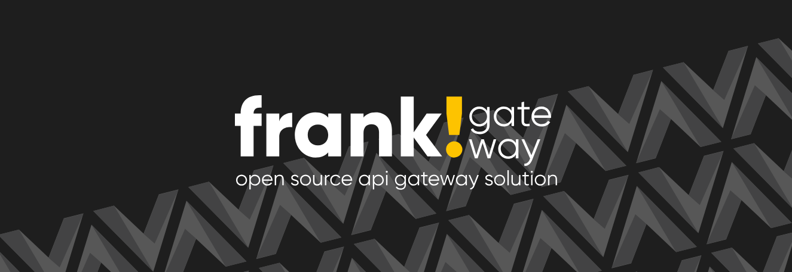

# Frank!Gateway



Frank!Gateway is an API gateway built for the specific needs of Dutch municipalities. Its core addition is **full bidirectional traffic support**: connections can run both from SaaS solutions to on-premises systems (outside-in) and from on-premises systems to SaaS services (inside-out).

Frank!Gateway is based on [Apache APISIX](https://apisix.apache.org/) and extends it with capabilities tailored to the municipal market. By building on a proven, high-performance foundation, Frank!Gateway inherits the strengths of APISIX while adding the functionality that Dutch government organisations need.

## Why Frank!Gateway

Additional capabilities tailored to the municipal market:

- **Bidirectional traffic** – supports both outside-in (SaaS to on-premises) and inside-out (on-premises to SaaS) connections
- **SOAP routing support** for legacy systems (ZDS)
- **FSC standard support** via the FSC-Inway plugin
- **Authorization based on AuthZEN and Open Policy Agent (OPA)**, e.g. for accessing BRP data
- **Response extractor** collects relevant message data for logging, auditing and accountability

### Built on a solid foundation

Frank!Gateway inherits the core strengths of Apache APISIX:
- Fully Open Source – part of the Apache foundation as a top level project with a large contributor base
- Runs everywhere (including ARM64): bare metal, Kubernetes, cloud, and VM
- Pluggable configuration based on a rich plugin ecosystem
- Top ranked for performance


## Layout & Structure
This repository contains two components:
1) deployment configurations & examples which can be found on the directory `deployment-examples`
2) source code for custom plugins

### Building the images
The Frank!Gateway can be built using the following command:
```shell
docker build --build-arg BUILD_DATE=$(shell date -u +'%Y-%m-%dT%H:%M:%SZ') -t frank-api-gateway .
```

### Minimum requirements
**Minimum:**

| Resource | Minimum                      |
|----------|------------------------------|
| CPU      | 1 vCPU                       |
| Memory   | 256–512 MB RAM               |
| Storage  | 1+ GB container image + logs |

**Recommended:**

| Resource | Recommended                  |
|----------|------------------------------|
| CPU      | 2 vCPU                       |
| Memory   | 1–2 GB RAM                   |
| Storage  | 1+ GB container image + logs |


### Versioning and Release strategy

Versioning & Release Strategy

This project follows Semantic Versioning (SemVer):
```
MAJOR.MINOR.PATCH
```
Example:
```
v1.2.3
```

### Deployment configurations & examples
The directory `deployment-examples` contains four deployment scenarios for deploying APISIX. Note, this deploys vanilla APISIX without the FSC plugin.
The goal of these deployment examples is for experimenting with Apache APISIX in different deployment approaches.

Without any prior Apache APISIX experience it is recommended to start with the `docker-compose` deployment-example since this is the easiest one to get started.

The `docker-compose deployment` does contain the `improved SOAP functionality` mentioned above. 

- docker-compose -> deploys APISIX via Docker compose [instructions](deployment-examples/docker-compose/README.md)
- kind -> deploys APISIX in normal mode on a local Kubernetes cluster using Kind [instructions](deployment-examples/kind/README.md)
- kind-ingress -> deploys APISIX as a Kubernetes ingress on a local cluster using Kind [instructions](deployment-examples/kind-ingress/README.md)
- rancher -> deploys APISIX as a Kubernetes ingress on the WAF rancher cluster [instructions](deployment-examples/rancher/README.md)

### Custom plugins
Custom plugins have been created for the Frank!Gateway, enhancing the functionality of Apache APISIX for the municipal market.

#### FSC Inway
- Can act as an Inway within an FSC NLX group
- Composable with various APISIX plugins

#### SOAP Action Router
- Routes based on the SOAP action (in the header, Content-Type, or body)
- Enables routes per specific SOAP operation

#### OIDC Client
- Lets the Frank!Gateway act as an OIDC client
- Supports the client credentials flow toward upstream systems

#### Generic OAuth Client
- Flexible variant of the OIDC plugin
- Supports configurable fields

#### Limit Size
- Blocks requests/responses that exceed a configured size
- Protects against excessive payload usage

#### Response Extractor
- Extracts values from JSON responses using JSONPath
- Makes them available as context variables for downstream plugins and logging

#### Cert Auth (mTLS)
- Supports certificate-based client authentication (CN/SAN)
- Identifies APISIX consumers via mTLS

#### Frank Sender
- Sends requests to a Frank endpoint first
- Uses the response as a new request toward the upstream
- Centralizes mapping and transformation logic

#### JWT Client
- Retrieves JWT access tokens from external IdPs
- Caches tokens and attaches them to upstream requests

#### OPA (extension)
- Patch to the existing APISIX OPA plugin
- Adds support for the request body in policy evaluation

#### AuthZEN Plugin
- Implements the OpenID AuthZEN protocol
- Integrates with policy engines such as OPA/Rego, XACML, Zanzibar, and IDQL

#### Stdout Logger
- Writes a configurable, structured JSON log line per request to stdout
- Log fields are a template of APISIX/nginx variables, resolved per request
- Supports an optional `labels` map to output structured log labels (e.g. for Grafana Alloy / Loki stream processing)
- Can optionally include the request/response body and headers
- Classifies each entry with a `log_type` (`Error`/`Warn`/`Info`) based on the response status

### Merge-config plugin
Our custom merge-config plugin offers the possibility to merge multiple APISIX configuration files into one functional `apisix.yaml`. This allows for functional separation beyond APISIX's normal possibilities.


