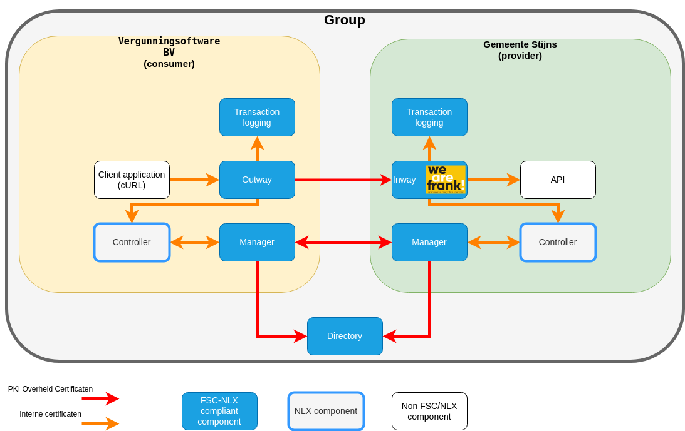
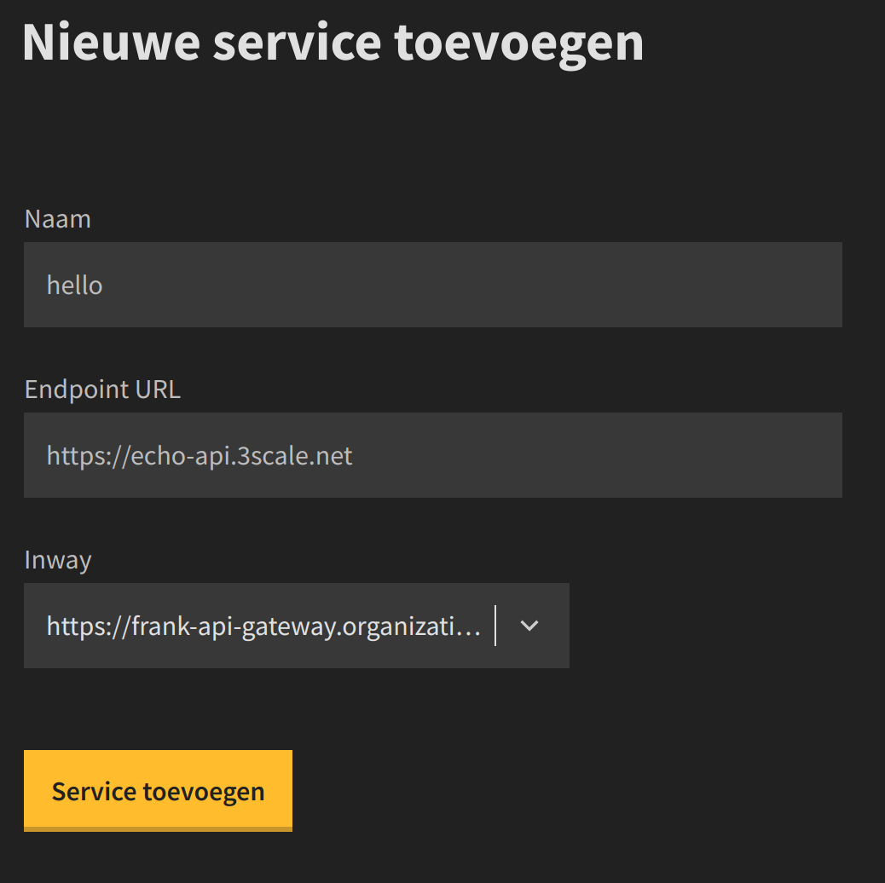

# FSC plugin
In order to use APISIX as an `FSC Inway` a custom plugin is created. The source code for this plugn as well as some required directories for running the plugin locally are part of this repository. More information about an FSC Inway can be found in the official standard: [here](https://commonground.gitlab.io/standards/fsc/core/draft-fsc-core-00.html#name-inway)

The plugin runs APISIX in [standalone](https://apisix.apache.org/docs/apisix/deployment-modes/#standalone) mode, so no ETCD is needed. This is convenient for easy local testing the plugin.
There are three subdirectories of this template:
- conf
- logs
- src

The `conf` directory contains the configuration files for APISIX to run and configure in standalone mode. A minimal configuration is provided to get you up and running. 

The `logs` directory contains the log files (access.log and error.log) from the container for easier troubleshooting. 

The `src` directory contains the source code for the custom plugin. Here you can place your lua files and subdirecties for developing your custom plugin. For more information regarding the development of a custom APISIX plugin see the official docs: https://apisix.apache.org/docs/apisix/plugin-develop/


The directories mentioned above are mounted in the container as follows:
conf/config.yaml -> /usr/local/apisix/conf/config.yaml
conf/apisix.yaml -> /usr/local/apisix/conf/apisix.yaml
logs/ -> /usr/local/apisix/logs
src/ -> /usr/local/apisix/custom-plugins

## Running the FSC plugin locally 
In order to run Apache APISIX and the FSC plugin locally you need some prerequisites.

### Prerequisites
- Docker (essential) for running Apache APISIX locally on different operating systems [installation guide](https://docs.docker.com/engine/install/)
- Make (optional) the Makefile in this repository makes it easier to execute the various Docker commands [documentation](https://www.gnu.org/software/make/) (reference your specific OS for install instructions)
- cURL (optional) cURL is used to issue test requests to the container, any http client can be used as an alternative as long as it supports mTLS connections (most Linux based operating systems will have this already installed)
- jq (optional) jq is used to parse the json response of api calls [documentation](https://jqlang.github.io/jq/). As an alternative you can extract the information from json payloads yourself.

Windows users need to use WSL to run Apache APISIX and Docker installed via WSL. 
The Windows Subsystem for Linux, or WSL, is an optional feature of Windows 10 that allows Linux programs to run natively on Windows. You can download the WSL package for 64-bit machines [here](https://docs.microsoft.com/en-us/windows/wsl/install-manual#step-4---download-the-linux-kernel-update-package).

## Starting Apache APISIX with the FSC plugin
APISIX containing your custom configuration and plugin are run using the APISIX Docker container. While perfectly possible to use the Docker CLI to run APISIX a Makefile is created for convenience. 

The Makefile contains the following commands:
- dev-startup -> creates and start the docker container with the appropriate volume mounts
- dev-start -> starts an existing container
- dev-stop -> stops the container
- dev-rm -> removes the container
- dev-reload -> issues the `apisix reload` command inside the container

When the container is started a container with the name of `apache-apisix-standalone` is run. 

To startup the container for the first time:
```shell
make dev-startup
```

The container exposes port `9080` as the traffic port of APISIX.

### Testing the FSC Plugin

In order to test the FSC plugin a local FSC cluster (also called a `group`) is needed. First make sure a local FSC cluster is installed and running locally using the instructions [here](https://gitlab.com/commonground/nlx/fsc-nlx)

The test setup has the following overview of components:


With all FSC components running the next step is to perform some preliminary setup steps. 
In order to execute API requests to the Frank API Gateway acting as an FSC NLX Inway some preliminary setup steps need to be executed.

#### Preliminary step 1
The second step is to expose a service via our newly registered Inway. Which in our case is the Frank API Gateway. 


This is done via the UI of manager which is served by the controller component. Since the Inway is registered in `Gemeente Stijns` we need to go to the manager of `Gemeente Stijns`
Which can be found [Gemeente Stijns (Organization A) (HTTP: 3011)](http://controller.organization-a.nlx.local:3011/) (credentials: admin@nlx.local / development)


Next go to `Services` http://controller.organization-a.nlx.local:3011/services and click `+ Service Toevoegen`

Fill in the form for creating a new service: 
- name: hello
- endpoint URL: https://echo-api.3scale.net
- Inway: select the frank api gateway



#### Preliminary step 2
The last preliminary step is to issue a service connection request from one organization to another. This is done by creating  a `contract` containing a `service connection grant` from the organizatin `Vergunningsoftware` to the organization `gemeente Stijns` (our service provider)


This is done by performing the following steps:
- go to the manager UI of `vergunningsoftware` (http://controller.organization-c.nlx.local:3031)
- go to the `contracts` page (http://controller.organization-c.nlx.local:3031/contracts) and click `+ Add contract`
- Click the `+ Add` below the `Service Connection grant`
- Fill in the form with the following fields:
    - Service Peer ID: 12345678901234567890
    - Service Naam: hello
    - Outway Peer ID: 12345678901234567892
    - Outway certificate thumbprint: select the only option
- click `Add contract` at  the bottom of the page


However the contract is not yet valid since it must be accepted by the organization providing the service. In our case this is `Gemeente Stijns`.
- go to the manager UI of `Gemeente Stijns` (http://controller.organization-a.nlx.local:3011/)
- go to the contracten page (http://controller.organization-a.nlx.local:3011/contracts)
- click on the `magnifying glass icon` next to the contract
- click on the `Accept` at the bottom of the modal


#### Executing requests
Make sure the Frank API Gateway with the custom FSC plugin is running (see above).


With all the preliminary steps done we can issue requests from `Vergunningsoftware` to  `Gemeente Stijns`

The request will be send to the `Outway` of `Vergunningsoftware` which invokes the  `Inway` (Frank API Gateway) of `Gemeente Stijns`.

In order to have the outway select the correct contract for making the request we need to provide the `grant hash` of the contract in our request.

The `grant hash` can be found in the details of the contract (by selecting the magnifying glass next tot the contract).


Lastly we can issue a curl request to the outway with the `grant hash`. The curl request needs to be issued from the `fsc-nlx` since it uses a certificate and key for establishing the mtls connection.
`Make sure you replace the Fsc-Grant-Hash header with the grant hash from your contract`.
```bash
curl -v -H 'Fsc-Grant-Hash: $1$4$miw9YBmmnyDVnxkDVzgooUETSlECr5GNQ1wdyeoFVevxIrMK8zfapnwZP_Y1ZRKqtvRbRC8iiPiGwjcEOgUY5w==' outway.organization-c.nlx.local/hello
```

## Current status
Both The FSC standard as well the plugin is currently work in progress:
- [x] Perform mTLS (this is not a feature of the plugin but rather a feature of APISIX that needs to be configured)
- [x] Extract the Peer_ID (Organization number) from the TLS client certificate
- [x] retrieve the public certificate from a JWKS endpoint
- [x] Validate the JWT in the `Fsc-Authorization` header
- [x] Perform `certificate bound token validation` according to: [RFC 8705](https://www.rfc-editor.org/rfc/rfc8705#name-jwt-certificate-thumbprint-)
- [x] Respond with FSC error codes
- [x] Enable caching for JWKS keys
- [x] FSC logging (waiting for FSC-NLX issue: https://gitlab.com/commonground/nlx/fsc-nlx/-/issues/41)
- [ ] Optional routing based on JWT claim servicename (APISIX can likely handle all routing requirements out of the box. If FSC token based routing needs to be implemented see: https://api7.ai/blog/dynamic-routing-based-on-user-credentials)
- [ ] Optional get JWKS via endpoint
- [x] Optional register Inway automatically by the manager of the organization (waiting for FSC-NLX issue: https://gitlab.com/commonground/nlx/fsc-nlx/-/issues/41)
