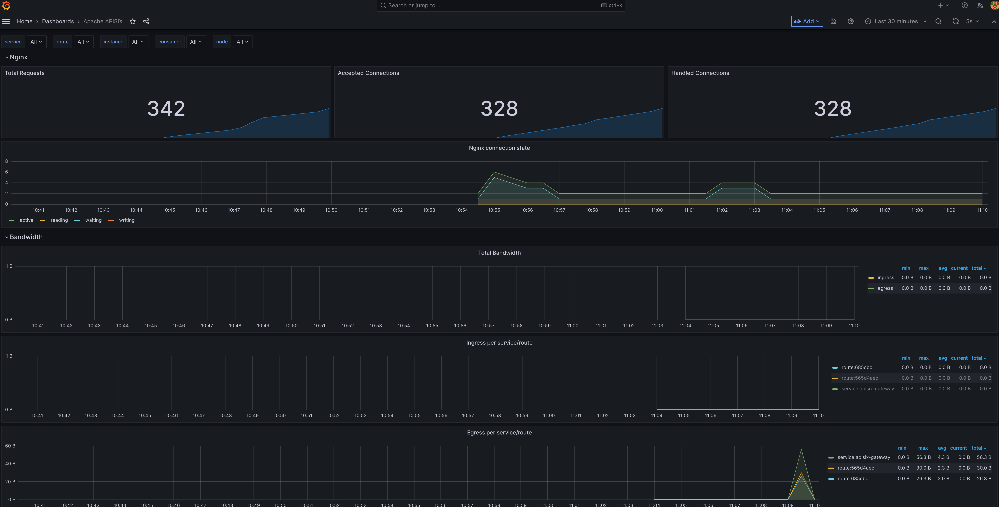

# APISIX Ingress using Kind
Setup a minimal local kubernetes cluster using [kind](https://kind.sigs.k8s.io/) and deploy the APISIX ingress controller. 

## Prerequisites
- Install [kind](https://kind.sigs.k8s.io/docs/user/quick-start/)
- Install [Helm](https://helm.sh/)
- Install [kubectl](https://kubernetes.io/docs/tasks/tools/)

### Commands

### Setup local Kubernetes cluster
To create a local kind cluster named `apisix-ingress` with a portmapping rule forwarding port 80 of the host to `nodeport` 30965 
```shell
kind create cluster --name apisix-ingress --config=kind-cluster-config.yaml
```

### Install Helm repo's
```shell
helm repo add apisix https://charts.apiseven.com
helm repo add bitnami https://charts.bitnami.com/bitnami
helm repo add prometheus-community https://prometheus-community.github.io/helm-charts
helm repo update
```

### Install APISIX Ingress via Helm charts
Create a namespace for the APISIX Ingress
```shell
kubectl create ns ingress-apisix
```

Create a namespace for Keycloak
```shell
kubectl create ns iam
```

Install Prometheus
```shell
helm install -n monitoring prometheus prometheus-community/kube-prometheus-stack \
  --create-namespace \
  --set 'prometheus.prometheusSpec.serviceMonitorSelectorNilUsesHelmValues=false'
```

After Prometheus is installed we can install APISIX.

Load the Frank-API-Gateway image in kind:
```shell
kind load docker-image frank-api-gateway --name apisix-ingress
```

Install APISIX Ingress
```shell
helm install apisix apisix/apisix \
  --set gateway.type=NodePort \
  --set ingress-controller.enabled=true \
  --set serviceMonitor.enabled=true \
  --namespace ingress-apisix \
  --set ingress-controller.config.apisix.serviceNamespace=ingress-apisix \
  --set apisix.image.repository=frank-api-gateway \
  --set apisix.image.tag=latest
```

Verify the service is created
```shell
kubectl get service --namespace ingress-apisix
```

Install Keycloak
```shell
kubectl create -f https://raw.githubusercontent.com/keycloak/keycloak-quickstarts/latest/kubernetes-examples/keycloak.yaml -n iam
```

Patch the nodeport for the service
Kubernetes by default assigns a nodeport in the range of 30000-32767

Since we made a kind `extraPortMapping` rule forwarding port `80` to `30965` we need to make sure the nodeport for the APISIX gateway is set to `30965`

```shell
kubectl patch svc apisix-gateway -n ingress-apisix --type='json' -p '[{"op":"replace","path":"/spec/type","value":"NodePort"},{"op":"replace","path":"/spec/ports/0/nodePort","value":30965}]'
```

In order to access the Grafana dashboard from the localhost we need to change the port from ClusterIP to Nodeport for the prometheus-grafana service:
```shell
kubectl patch svc prometheus-grafana -n monitoring --type='json' -p '[{"op":"replace","path":"/spec/type","value":"NodePort"}]'
```

With the service now exposed via a nodeport we can assign the correct nodeport to correspond with our Kind extraportmapping

```shell
kubectl patch svc prometheus-grafana -n monitoring --type='json' -p '[{"op":"replace","path":"/spec/type","value":"NodePort"},{"op":"replace","path":"/spec/ports/0/nodePort","value":30300}]'
```

In order to access Keycloak from the localhost we need to change the port from ClusterIP to NodePort for the keycloak service:
```shell
kubectl patch svc keycloak -n iam --type='json' -p '[{"op":"replace","path":"/spec/type","value":"NodePort"}]'
```
With the service exposed via a Nodeport we can  assign the correct nodeport to correspond with our Kind extraPortMapping
```shell

kubectl patch svc keycloak -n iam --type='json' -p '[{"op":"replace","path":"/spec/type","value":"NodePort"},{"op":"replace","path":"/spec/ports/0/nodePort","value":30880}]'
```

## Configuring keycloak
For local testing purposes a ephemeral keycloak with the default settings has been installed. This does result in some manual configuration.
This configuration is done via the Keycloak web console, which can be accessed via http://localhost:8080 with the following credentials:
username: admin
password: admin

### Import the exported realm & Create the apisix client
Create new realm and upload the json file: `apisix_test_realm.json`

Next import the apisix client. In the `apisix_test_realm` click -> Clients -> Import Client -> Upload the file: `apisix_client.json`

Next create one or more users: click: Users -> Create New User -> add username -> click Create -> click Credentials -> create password + disable temporary -> click save 

### Install Upstream API's
Installs two upstream (backend) API's `Foo` and `Bar`
```shell
kubectl apply -f upstream-apis.yaml
```

### Apply the APISIX ingress routing rules
The APISIX routing rules are Host based `'Host: foo.org'` will route to the `foo` service. `'Host: bar.org'` will route to the `bar` service.

```shell
kubectl apply -f http-route.yaml
```

### Verify the APISIX routes

## Test the foo route
The foo route configured using APISIX as a OIDC relying party. In order to test this flow perform the following:
- In a browser visit: `http://localhost/foo/hostname`
- you are redirected to the Keycloak login screen. Login with the credentials of the user you created earlier
- you should be redirected to the backend API

If everything is setup correctly the output should be:
foo-app

## Test the bar route

`prerequisite` since this relies on token introspection the token must be obtained via the same url as the client performing the introspection. Since APISIX is using the Kubernetes service address for introspection a custom host entry is needed on the local system for testing purposes. 
Create the following host file entry:
127.0.0.1	keycloak.iam.svc.cluster.local

In order to test this flow a access token needs to be obtained via the Client Credentials flow using the APISIX client and it's secret.

With the access token perform the following request:

Invoke the bar service via APISIX
```shell
curl -v localhost/bar/hostname -H 'Authorization: Bearer [YOUR TOKEN]'
```
If everything is setup correctly the output should be:
bar-app

## Configure Grafana to view the APISIX dashboard
With Prometheus and Grafana installed the APISIX dashboard can be imported.
In order to login to Grafana visit: http://localhost:3000
Since we did not change the default password for this local install login with:
username: admin
password: prom-operator

when logged in import the APISIX dashboard ID: `11719`

To visit the APISIX dashboard select the dashboard: `Apache APISIX`

This should look like this:
