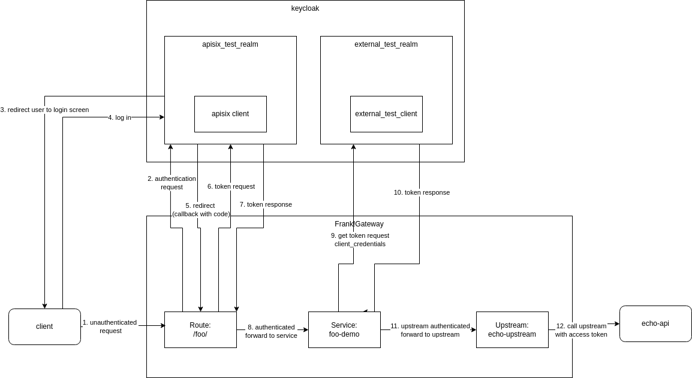

# openid-connect-client plugin

This plugin acts as a OpenID Connect client fetching an access token from an OpenID Connect Authorization server (IDP).

`Note: only the client credentials flow is supported!`

## Plugin configuration
The plugin has the following configuration options:
- client_id 
- client_secret
- token_endpoint
- default_expiration

### client_id
the `client_id` configured for the client in the `Authorization server`.

### client_secret
the `client_secret` used by the client in the `Authorization server`.

### token_endpoint
the OpenID Connect `token_endpoint` used to request `access_tokens` from the Authorization Server. This includes `scheme`, `host`, `port` and `path`.

### default_expiration
access tokens are cached to avoid unnecessary calls to the Authorization server. The cache expiration is determined from the token response `expires_in` field.
Not from the `exp` claim in the token!
When the token response does not contain a `expires_in` the value in `default_expiration` is used. The default value of `default_expiration` is 300 seconds.

## Using the plugin
This directory provides a demo setup using Keycloak as Authorization server.

For this demo two different OIDC flows are in play. The client of the Frank!Gateway uses the `Authorization Code flow` to authenticate with the `internal keycloak` represented as a separate keycloak realm: `apisix_test_realm`.
When authenticated the Frank!Gateway uses the `openid-connect-client` plugin to obtain an access token using the `Client Credentials flow` with the `external keycloak` represented as a separate keycloak realm: `external_test_realm`. 



### Prerequisites
In order to run the setup described above a Keycloak server is needed. Since both Keycloak and the Frank!Gateway are running in separate Docker containers and Keycloak needs a separate Hostname add the following entry in the `/etc/hosts` file:
```
127.0.0.1 keycloak.iam.svc.cluster.local
```

With the hostfile entry set start the Keycloak server:
```shell
docker run -p 8080:8080 --hostname keycloak.iam.svc.cluster.local \
 -e KEYCLOAK_ADMIN=admin \
 -e KEYCLOAK_ADMIN_PASSWORD=admin \
 -e KC_HOSTNAME=keycloak.iam.svc.cluster.local \
 -e KC_HOSTNAME_ADMIN=keycloak.iam.svc.cluster.local \
 -v $(pwd)/keycloak-export.json:/opt/keycloak/data/import/keycloak-export.json \
 quay.io/keycloak/keycloak:24.0.3 start-dev --import-realm
```

All the configuration required to run the described setup is imported during startup.

The administrative console is available at: `http://keycloak.iam.svc.cluster.local:8080/`

## starting frank!gateway in standalone mode
```shell
docker run -d --name frank-api-gateway-standalone \
  	-p 9080:9080 \
  	-p 9443:9443 \
  	-p 9090:9090 \
	-v $(shell pwd)/conf/config.yaml:/usr/local/apisix/conf/config.yaml \
	-v $(shell pwd)/conf/apisix.yaml:/usr/local/apisix/conf/apisix.yaml \
	--add-host=host.docker.internal:host-gateway \
	--add-host=keycloak.iam.svc.cluster.local:host-gateway \
  	frank-api-gateway:latest
```

## Test
In a web browser navigate to: `http://localhost:9080/foo/`

The first time you will be redirected to the `internal keycloak` and presented with a login screen.
Login using the credentials: foo/bar

After a successfull login the request is forwarded to a echo API. In the response observe the following fields:
`HTTP_X_ACCESS_TOKEN` which contains the access token obtained from the `internal keycloak`.
And `HTTP_AUTHORIZATION` which contains the access token obtained by the `openid-connect-client` plugin from the `external keycloak`