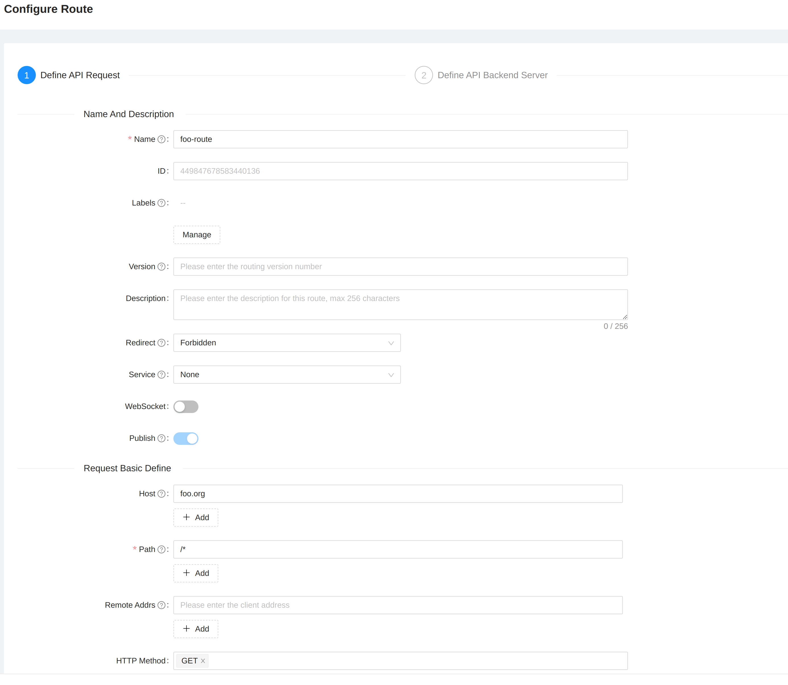
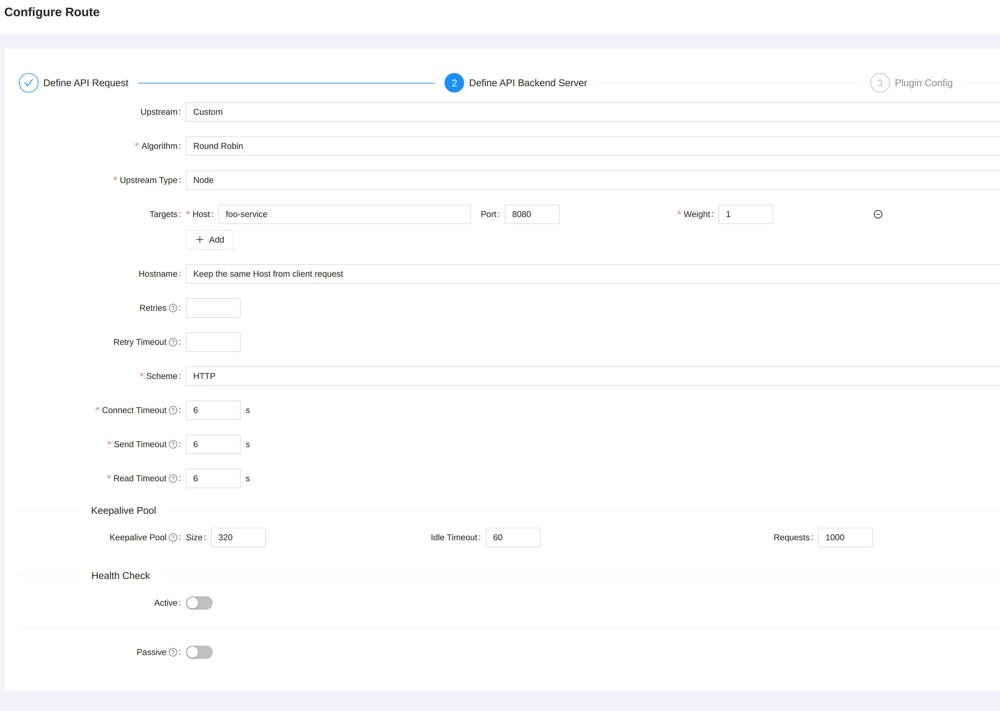

```shell
kind create cluster --name apisix --config=kind-cluster-config.yaml
```

```shell
kubectl create ns apisix
```

Install APISIX Gateway
```shell
helm install apisix apisix/apisix \
  --set admin.type=NodePort \
  --set admin.allow.ipList= \
  --set gateway.type=NodePort \
  --namespace apisix 
```

Patch the nodeport for the service
Kubernetes by default assigns a nodeport in the range of 30000-32767

Since we made a kind `extraPortMapping` rule forwarding port `80` to `32080` we need to make sure the nodeport for the APISIX gateway is set to `32080`

```shell
kubectl patch svc apisix-gateway -n apisix --type='json' -p '[{"op":"replace","path":"/spec/type","value":"NodePort"},{"op":"replace","path":"/spec/ports/0/nodePort","value":32080}]'
```

We also need to make the admin API accessible via an extraPortMapping. The kind `extraPortMapping` rule defined for the admin API was set to `32180` which is forwarded to `9180`

```shell
kubectl patch svc apisix-admin -n apisix --type='json' -p '[{"op":"replace","path":"/spec/type","value":"NodePort"},{"op":"replace","path":"/spec/ports/0/nodePort","value":32180}]'
```

Install the APISIX dashboard
```shell
helm install apisix-dashboard apisix/apisix-dashboard \
  --set service.type=NodePort \
  --namespace apisix 
```

Using the `extraPortMapping` we can expose the dashboard. The kind `extraPortMapping` rule defined for the dashboard was set to `30080` which is forwarded to port `80`
```shell
kubectl patch svc apisix-dashboard -n apisix --type='json' -p '[{"op":"replace","path":"/spec/type","value":"NodePort"},{"op":"replace","path":"/spec/ports/0/nodePort","value":30080}]'
```

To verify all services are using the correct NodePort, the output of the services should look similar to this
```shell
kubectl get svc --namespace apisix
NAME                   TYPE        CLUSTER-IP     EXTERNAL-IP   PORT(S)             AGE
apisix-admin           NodePort    10.96.5.198    <none>        9180:32180/TCP      29m
apisix-dashboard       NodePort    10.96.187.25   <none>        80:30080/TCP        10m
apisix-etcd            ClusterIP   10.96.72.46    <none>        2379/TCP,2380/TCP   29m
apisix-etcd-headless   ClusterIP   None           <none>        2379/TCP,2380/TCP   29m
apisix-gateway         NodePort    10.96.194.42   <none>        80:32080/TCP        29m
```

The APISIX dashboard can be visited on http://localhost with the default credentials. 

### Install Upstream API's
Installs two upstream (backend) API's `Foo` and `Bar`
```shell
kubectl apply -f upstream-apis.yaml -n apisix
```

### Configure APISIX rouites
Configure an APISIX route to the foo service using the dashboard:
When logged into the APISIX dashboard. Go to the `Route` tab and click `Create`.

On the first page of the route configuration wizard enter the following:
- route name: foo-route
- Host: foo.org
- HTTP method: [remove all but GET]



click `Next`

On the next page enter the following:
- Upstream Type: Node
- Targets:
    - Host: foo-service
    - Port: 8080



click 'Next' 

Since we are not using any plugins at the moment also click `Next` on the following page. Review the config and click 'Publish'

Configure an APISIX route to the bar service using the admin API. 

```shell
curl "http://127.0.0.1:9180/apisix/admin/routes/1" \
-H "X-API-KEY: edd1c9f034335f136f87ad84b625c8f1" -X PUT -d '
{
  "methods": ["GET"],
  "host": "bar.org",
  "uri": "/*",
  "upstream": {
    "type": "roundrobin",
    "nodes": {
      "bar-service:8080": 1
    }
  }
}'
```

### Verify the APISIX routes
Invoke the foo service via APISIX
```shell
curl -v localhost:8080/hostname -H 'Host: foo.org'
```
If everything is setup correctly the output should be:
foo-app

Invoke the bar service via APISIX
```shell
curl -v localhost:8080/hostname -H 'Host: bar.org'
```
If everything is setup correctly the output should be:
bar-app

### Kubernetes service discovery
#TODO the above setup only works when the backend services are deployed on the same namespace or services outside of the Kubernetes cluster are used as backend service. In order to better levarege the Kubernetes setup Kubernetes auto-discovery needs to be setup. This is done out of the box when using the kubernetes ingress controller