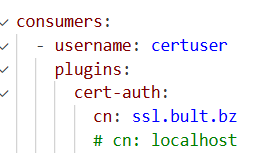
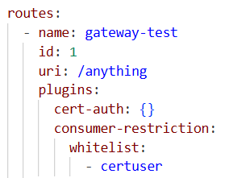

This readme explains how the cert-auth plugin works. The plugin is applied to the route by defining it in the apisix-standalone-config.yaml. Keep in mind that the way it is applied is in standalone version that is also why the certificates value are defined in the apisix-standalone-config.yaml

What is required of the plugin is to define a consumer with the plugin cert-auth and a field called cn. 



In this way when a connection is setup with mtls a consumer is added to the upstream. The plugin can also then be combined with the plugin consumer-restriction to allow users to the upstream who are defined in the list. 



Lastly the plugin has been tested with the following command:

```shell

openssl s_client -connect localhost:9443 -cert bultcert.pem -key bultcertenc.key -CAfile apisix.pem -servername localhost

```  (see certs/test/README.MD)