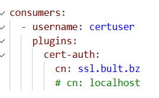
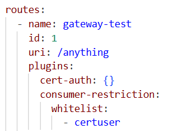

# cert-auth Plugin (Standalone)

This document explains how `cert-auth` is configured and tested in this repository.

In this setup, APISIX runs in standalone mode. That means TLS certificates, consumers, routes, and plugin configuration are all defined in `apisix-standalone-config.yaml`.

## How matching works

The `cert-auth` plugin can map a client certificate to a consumer in multiple ways.

- `cn`: match the certificate Common Name (CN)
- `identifier`: match SAN or CN

Current examples in this repository:

- Consumer `certuser` uses `cn: ssl.bult.bz`
- Consumer `testuser` uses `identifier: apisix.localhost`

## Route protection

Routes enable `cert-auth: {}` and are combined with `consumer-restriction` to control which authenticated consumers may access each route.

Example behavior:

- `/anything` only allows `certuser`
- `/headers` only allows `testuser`
- `/test-cn-with-identifier` rewrites to `/anything` and allows `certuser`

This provides both certificate-based authentication and route-level authorization.




## Test commands

Start from repository root.

### Certuser (CN-based)

```shell
openssl s_client -connect localhost:9443 -servername localhost -cert certs/test/client/certuser-new.pem -key certs/test/client/certuser-new.key
```

### Testuser (identifier-based via PKCS#12)

```shell
openssl pkcs12 -in certs/test/keystore/client.p12 -clcerts -nokeys -out certs/test/keystore/testuser-cert.pem -passin pass:
openssl pkcs12 -in certs/test/keystore/client.p12 -nocerts -nodes -out certs/test/keystore/testuser-key.pem -passin pass:
openssl s_client -connect localhost:9443 -servername apisix.localhost -cert certs/test/keystore/testuser-cert.pem -key certs/test/keystore/testuser-key.pem
```

For a full local setup and additional context, see `tests/cert-auth/README.MD`.