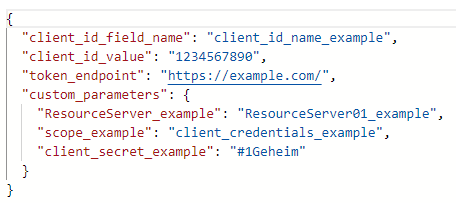
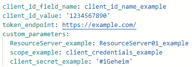

# Generic OAuth plugin

This plugin was made for flexibility when defining OAuth request parameters.

This plugin has the following fields:

|         Name         |  Type  | Required |      Description      |
|----------------------|--------|----------|-----------------------|
| client_id_field_name | string |   Yes    | The name of the field that will be equivalent to client_id in the oauth request, e.g. "customer_id" |
|   client_id_value    | string |   Yes    | The value for the field defined in "client_id_field_name", e.g. "example_client_id" |
|   token_endpoint     | string |   Yes    | The URL of the token endpoint to which the plugin will send its request |
|  custom_parameters   | object |   No     | A collection of self-defined key-value pairs where the key is the parameter name and the value is its corresponding value, e.g. `"custom_scope_parameter":"scope_value"` in JSON or `custom_scope_parameter: scope_value` in YALM |

#### Example configs:
#### JSON 

#### YAML

