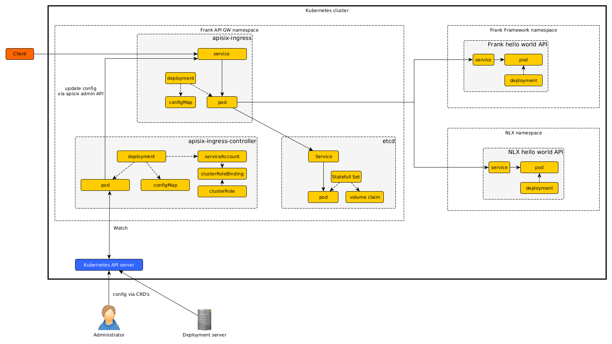
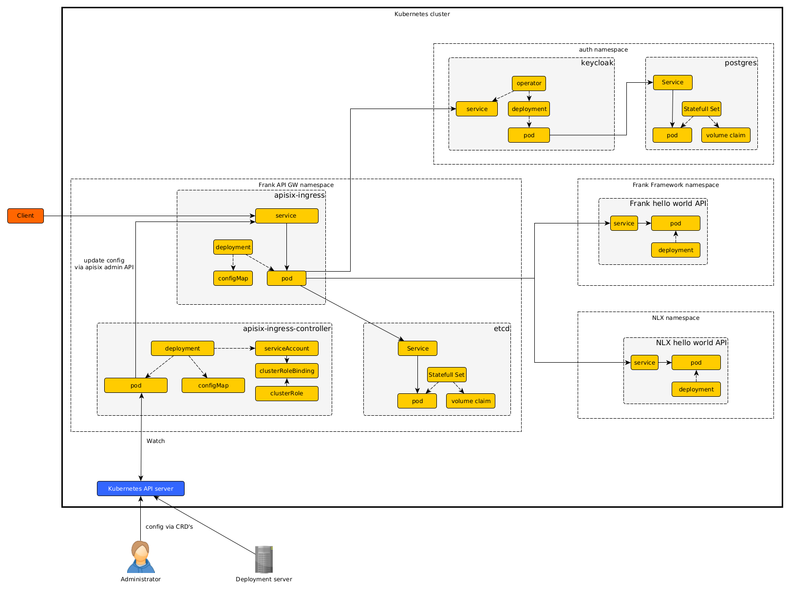
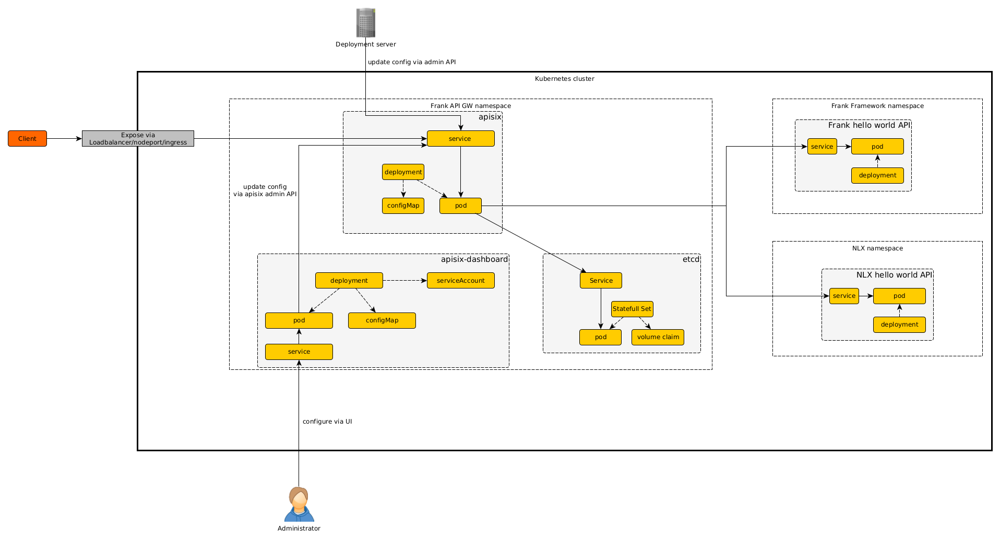
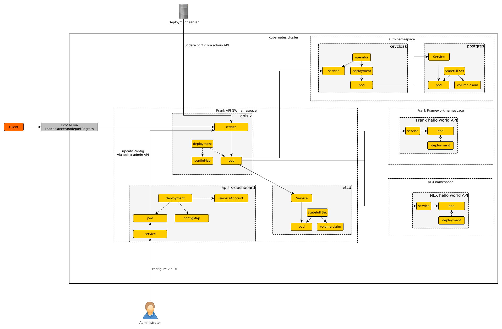

# APISIX Kubernetes architecture

APISIX allows for two different ways of deploying on a Kubernetes environment
1. Ingress controller
2. Regular deployment

The main difference between the `ingress` way and the `regular` way is the manner in which APISIX is configured. 

When deploying APISIX as a Kubernetes `ingress` APISIX is configured in a declarative manner using Kubernetes Custom Resource Definitions (CRD's). This ties in nicely with a "Kubernetes" way of working. 
However, the APISIX dashboard does not work in conjunction with the APISIX ingress controller. 

When deploying APISIX as a regular Kubernetes deployment the APISIX dashboard can also be deployed for configuring and managing APISIX, including configuring APISIX using Open API specification files. However, APISIX does need either a separate ingress or another way to expose APISIX outside of the Kubernetes cluster. 

For both ways Helm charts (provided by APISIX) are the recommended way for installing. 

It is good to note that in both cases APISIX uses it's own `etcd`, and does not levarage the `etcd` from Kubernetes. 

Both scenarios are described in further detail below. 

## scenario 1 APISIX as a Kubernetes ingress



The APISIX API Gateway consists of 3 major components:
- apisix-ingress  - the APISIX API gateway
- apisix-ingress-controller - the ingress controller converting the Kubernetes CRD manifests to APISIX configurations and invoking the APISIX gateway admin api to configure the APISIX gateway
- etcd - storage for the APISIX gateway configuration

An administrator can either manually configure APISIX using Kubernetes CRD's
For example by creating a APISIX route using:
```shell
cat <<EOF | kubectl apply -f -
apiVersion: apisix.apache.org/v2
kind: ApisixRoute
metadata:
  name: httpserver-route
spec:
  http:
  - name: rule1
    match:
      hosts:
      - local.httpbin.org
      paths:
      - /*
    backends:
       - serviceName: httpbin
         servicePort: 80
EOF
```

In it's most basic scenario APISIX acts as API gateway for a Frank framework hello-world API. 
Additionally a NLX hello-world API can be deployed as a secundary upstream served via APISIX API gateway. 

For both upstreams (backend API's) rate limiting and simple key based API authentication can be implemented. 

## scenario 1a extending with OpenID Connect authentication
The above scenario can be extended with OpenID Connect (OIDC) authentication using an OIDC authorization server. In this example keycloak is used as a OIDC authorization server. 


Using the Keycloak Authorization server in combination with the APISIX keycloak plugin Upstream API's can be secured using OIDC.

## scenario 2 APISIX as a regular Kubernetes deployment

As an alternative to deploying APISIX as a Kubernetes ingress APISIX can be deployed as a "regular" service within Kubernetes. The main difference is the manner in which APISIX is configured. Where the "regular" deployment uses the APISIX dashboard instead of the Kubernetes CRD's for manual configuration. It is good to note the configuration using Open API specifications is a feature of the APISIX dashboard and therefore only available when the APISIX dashboard is available. 


The APISIX API Gateway consists of 3 major components:
- apisix - the APISIX API gateway
- apisix-dashboard - The UI dashboard for adminitering APISIX
- etcd - storage for the APISIX gateway configuration

Similar to scenario1 APISIX acts as API gateway for a Frank framework hello-world API. 
Additionally a NLX hello-world API can be deployed as a secundary upstream served via APISIX API gateway. 

For both upstreams (backend API's) rate limiting and simple key based API authentication can be implemented. 

## scenario2a extending with OpenID Connect authentication
The above scenario can be extended with OpenID Connect (OIDC) authentication using an OIDC authorization server. In this example keycloak is used as a OIDC authorization server. 


Using the Keycloak Authorization server in combination with the APISIX keycloak plugin Upstream API's can be secured using OIDC.