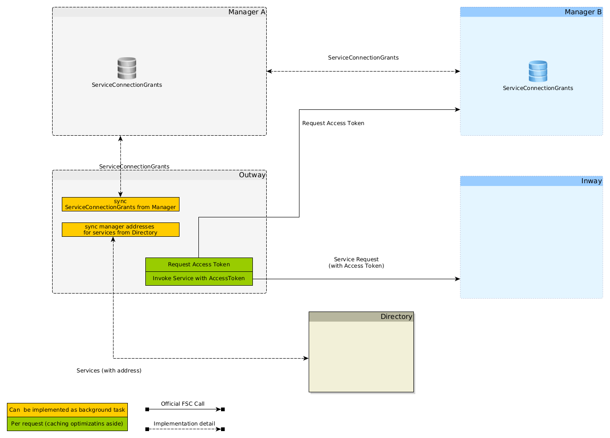
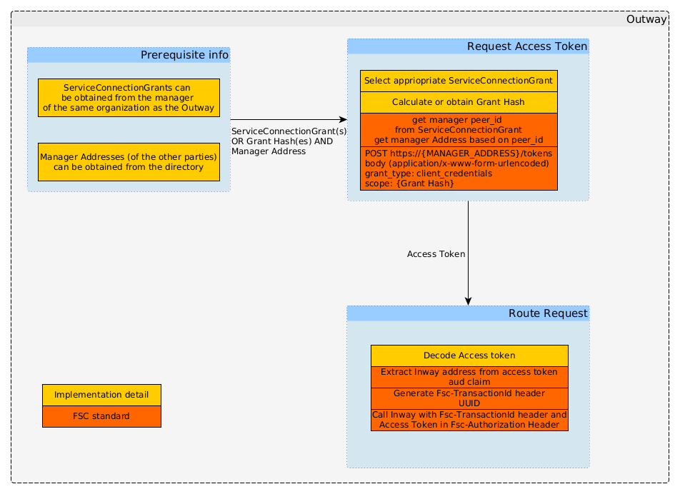

# Notes for implementing an Outway
The Outway in FSC acts as a forwarding proxy managing outgoing connections and authenticating consumers with Access Tokens. More details on the behaviour of an FSC Outway can be found in the [official standard](https://commonground.gitlab.io/standards/fsc/core/draft-fsc-core-00.html#name-outway).

But the main features can be summarized as follows:
- establishing mTLS connections with the other components (managers, directories, inways)
- requesting access tokens (JWT) from FSC Managers of other organisations participating in the FSC network
- Routing the request to the correct Inway (with the access token) of other organisations participating in the FSC network

However in order to perform the above tasks additional information is required. How the Outway obtains this information is not part of the FSC standard and must be left to the implementor. The details in this document present one way of obtaining this additional information. But others may exist. 

## establishing mTLS connections
Apart from needing `PKI-Overheid` certificates there is nothing FSC specific in the mTLS connections.


In order to do this the Outway must have a list of all available `ServiceConnectionGrant` available in the manager. `note, the ServiceConnectionGrant is exchanged between managers, so is available in the manager governing the Outway. All contracts including the ServiceConnectionGrant contract can be retrieved from a manager using the manager API using the following request:
`GET /contracts` 
`Note, the ServiceConnectionGrant does not contain the "grant hash" (gth) which is needed for requesting the access token` 

## Retrieving an access token
Access tokens are issued by managers in FSC. When an outway of organisation A wants to invoke a service of organisation B the outway of organisation A must retrieve an access token from the manager of organisation B.

This is done by calling the manager API of organisation B using the following request:
```
POST /contracts 
Content-Type: application/x-www-form-urlencoded

grant_type=client_credentials&scope=[grant-hash]
```

### The outway therefore needs the `grant hash (gth)`.

The grant hash cannot be obtained via an FSC endpoint. According to the FSC specification the grant hash can be calculated based on the information in the different kind of contracts. For the Outway contracts with the `ServiceConnectionGrant` are applicable. How to calculate the grant hash is described [here](https://commonground.gitlab.io/standards/fsc/core/draft-fsc-core-00.html#section-3.3.4).

`Note, the FSC/NLX reference implementation "solves" this by having the grant hash provided by the component invoking the Outway. However this makes the outway logic a lot simpler, but moves the problem to the consumer calling the outway leaking FSC specific things.` 

The situation is complicated further since multiple `ServiceConnectionGrants` might exists within an organisation so the Outway needs to be able to ultimately obtain the right grant hash.

A possibility for the outway of obtaining the `ServiceConnectionGrant` is to retrieve these from its own manager. Using the HTTP call `/Get contracts` all contracts can be retrieved from the manager. Optionally the contracts with a specific grant like the `ServiceConnectionGrant` can be retrieved by providing the grant type as a query parameter.

As stated above the outway obtains the access token from the manager of the organisation providing the service. 

### The outway therefore needs the `manager address`. 
>The `ServiceConnectionGrant` mentioned above contains the `peer_id` of the manager. The FSC standard states:
The Outway MUST either request an access token from the Peer specified in the `grant.data.service.peer_id` field of the ServiceConnectionGrant. 

However, the `peer_id` is not the manager address, just the unique identifier of the manager in the FSC group. 
The manager address can be retrieved from the FSC directory Using the HTTP request `GET /services` this endpoint returns all services for which the directory has a valid `ServicePublicationGrant`. Optionally the `peer_id` can be provided in the request as a query parameter to narrow down the response. 

### Summary
In order for the outway to retrieve an access token the Outway needs:
- The grant hash - which can be calculated from the ServiceConnectionGrant which can be retrieved from the manager the Outway belongs to
- The manager address of the manager providing the service - which can be obtained from the FSC directory

## Routing the request to the correct inway
The outway must route (forward) the request to the inway providing the service. With the Access token and and Fsc Transaction Id.

### The outway therefore needs the address of the inway
The address of the inway is present in the access token. In order to extract the address of the inway the access token must be decoded. The address of the inway is in the `aud` claim of the access token. 

### Generate the transaction Id
The outway must provide a unique transaction id in the form of a UUID and add this the the HTTP header `Fsc-Transaction-Id`. `Note it is currently under debate wheter the UUID must be a UUIDv4 or a UUIDv7`

### Access token
The Access token must be added to the `Fsc-Authorization` header.

## High level overview
The different components interacting can be depicted as follows:


`Note: only the relevant components and interactions specific for the outway are shown`

## Outway functionality
When zooming into the outway the functionality above can be depicted as follows:
