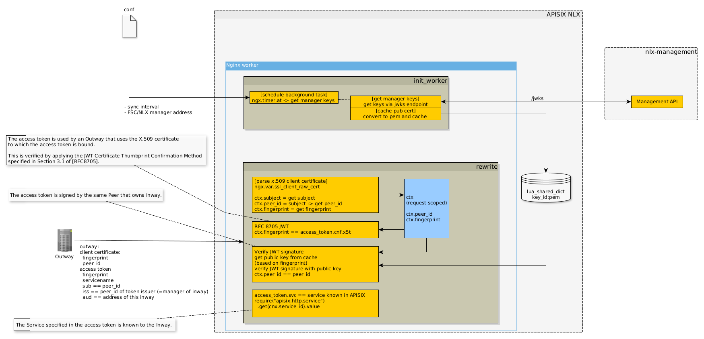

# APISIX as an NLX/FSC Inway

There are two aspects in order for APISIX (or any other gateway) to function as an NLX Inway:
1) handling traffic conformant to the NLX/FSC specification
2) ~~handle registration of the Inway and it's services in the registry and the NLX management~~

Note, this would still require the NLX Management API and optionally the NLX Management UI. 

## Traffic handling conformat to NLX/FSC specification

In order for APISIX to handle traffic according to the NLX/FSC specification as an Inway the following features must be implemented in APISIX.

- mTLS connections 
    - verify clients based on their client certificate 
        - PKI Overheid CA??
        - extract and verify NLX organization indentifier from the certificates `serialNumber` as part of the `CN` 
- Add NLX organization identifier to HTTP Header `X-NLX-Request-Organization` 
- perform authorization
    - The access token is signed by the same Peer that owns Inway.
    - The access token is used by an Outway that uses the X.509 certificate to which the access token is bound. This is verified by applying the JWT Certificate Thumbprint Confirmation Method specified in Section 3.1 of [RFC8705].
    - The Service specified in the access token is known to the Inway.
- respond with NLX errors https://gitlab.com/commonground/nlx/nlx/-/blob/master/docs/docs/support/common-errors.md 

## NLX registration
`In the FSC standard it is no longer required to register the Inway with the directory. However, the manager does need to know the address of the Inway and the services exposed with that partticular service. How this is achieved will be part of the reference implementation but not the FSC standard.` 

A draft of the technical setup of the NLX/FSC plugin in APISIX can be depicted as follows:

Open points:
- [x] ~~FSC does not provide a standard mechanism of obtaining the public key from the manager in order to validate the access token~~
    - [x] ~~Can the GET /certificates endpoint of the manager also be used to retrieve the public key of the manager that can be used for validating access tokens? If so how can this key be obtained from the map?~~ 
    - this will be changed to use a JWKS endpoint
- [x] ~~the inway needs the grant (ServiceConnectionGrant) from the manager in order to perform additional validation of the access token. However obtaining these grants is awkward at best, three possible solutions can be created for this:~~
    - ~~"invert" the data structure and store all grants based on peer_id~~
        ~~- this results in a datatransformation and storage of lot of duplicate data~~
    - ~~re-calculate the granthash and use this as a key for storing the hash~~
        - ~~the calculation of the hash is prone to implementation differences (e.g. encoding scheme)~~
    - ~~the GET /contracts returns per grant the grant hash in the response~~
        - ~~this is the preferred solution, however this does require the FSC/NLX endpoint to be changed~~
    - this will be removed from the FSC standard, all grant/contract related checks are performed by the manager.